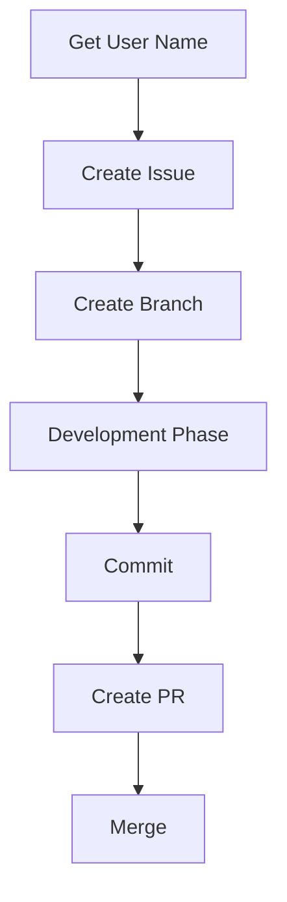

# Development Workflow Rules

## Basic Flow



## 0. Preparations

### Get GitHub User Name

Before starting, make sure to get your GitHub user name:

```bash
# Use GitHub MCP
get_user()
```

This command retrieves the user name, which is used in subsequent Issue creation and assignment.

## 1. Issue Management

### Create Issue (First Step)

### Use MCP (Recommended)

```bash
create_issue(
  title="Feature Name: Detailed Description",
  body="Use Issue Template",
  labels=["enhancement"],
  assignees=["username"]
)
```

### Issue Template

Refer to `.github/ISSUE_TEMPLATE/default.md`

### Phase Template

```markdown
## Implementation Phase

- [ ] Phase 1: Environment Setup and Preparation

  - [ ] Create Branch (`feat/123-feature`)
  - [ ] Add Dependencies

- [ ] Phase 2: [Detailed Task]


- [ ] Phase N: Testing and Verification
  - [ ] Build Test
  - [ ] Function Test

## Completion Conditions

- [ ] All Phases Completed
- [ ] Tests Passed
- [ ] Review Completed
```

### Label Classification

- Priority:

  - `priority/high`
  - `priority/medium`
  - `priority/low`

- Type:

  - `enhancement`
  - `fix`
  - `docs`

- Status:

  - `in-progress`
  - `review-needed`
  - `blocked`

## 2. Branch and Git Operations

### Create Branch

```bash
# Create Branch after Issue creation
# Example: git checkout -b feat/123-user-auth
```

### Branch Naming Convention

Refer to `.docs/CONTRIBUTING.md`

### Commit Management

#### Commit Timing

- Commit after each Phase completion
- Commit after meaningful units of work

#### Manual Commit (Recommended)

```powershell
git add .
git commit -m "Phase 2 completed: User Authentication Feature (#123)"
```

#### Commit Message Format

- Concise Japanese description
- 50 characters or less as a guideline
- Include Issue Number

```markdown
# Good example
Phase 1 completed: Environment Setup (#123)
Bug fix: Login Process (#124)

# Bad example (too long and in English)
feat(authentication): implement comprehensive user authentication system...
```

## 3. Issue Update and Linkage

### Update Progress

```bash
# After Phase completion
update_issue(
  issue_number=123,
  body="Updated Phase Checklist"
)

# Add Comment
add_comment(
  issue_number=123,
  body="Phase 2 completed. Commit: abc1234"
)
```

### Regular Push

```bash
git push origin feat/123-user-auth
```

## 4. PR Creation and Merge

### PR Creation Preparation

- Confirm all Phases completed
- Run final tests
- Include Issue Number in PR title and description

### PR Creation (MCP Recommended)

```bash
create_pull_request(
  title="feat: User Authentication Feature Implementation (#123)",
  body="Use PR Template",
  head="feat/123-user-auth",
  base="main"
)
```

### Merge and Completion

- Automatic checks passed
- Manual review completed
- Author merges after approval
- Issue automatically closed

### Post-Merge Processing

```bash
# Delete Branch
git branch -d feat/123-user-auth
git push origin --delete feat/123-user-auth
```

## 5. Completion Information Recording

### Issue Completion Information

```markdown
## Completion Information

- Completion Date: YYYY-MM-DD
- Time Required: X hours
- Main Challenges: [Problems and Solutions]
- Learning Points: [Knowledge for Future Reference]
- Related PR: #456
```

## Mandatory Checklist (Example)

### Before Starting

- [ ] GitHub User Name retrieved
- [ ] Issue created
- [ ] Phases defined
- [ ] Appropriate labels set
- [ ] Branch created (including Issue Number)

### During Development

- [ ] Commit after each Phase completion
- [ ] Include Issue Number in commit message
- [ ] Update Issue checklist
- [ ] Regular push

### After Completion

- [ ] All Phases completed
- [ ] Final tests run
- [ ] PR created (including Issue Number)
- [ ] Automatic review passed
- [ ] Manual merge executed
- [ ] Issue automatically closed
- [ ] Branch deleted

## MCP Utilization Points

- **User Name Retrieval**: GitHub MCP
- **Issue Creation and Update**: GitHub MCP
- **PR Creation**: GitHub MCP
- **Issue Search**: GitHub MCP

## Search and Reference

### Efficient Issue Search

- `is:issue is:open label:enhancement` - Open enhancement issues
- `is:issue author:username` - Issues created by the user
- `is:issue "Phase 1"` - Issues related to Phase 1

## Notes

- Issue creation is the first mandatory step
- **Include Issue Number in branch name and commit message**
- Direct commit to `main` branch is prohibited
- Prioritize MCP usage
- Manual merge is mandatory
- Progress is managed within the Issue (Single Source of Truth)